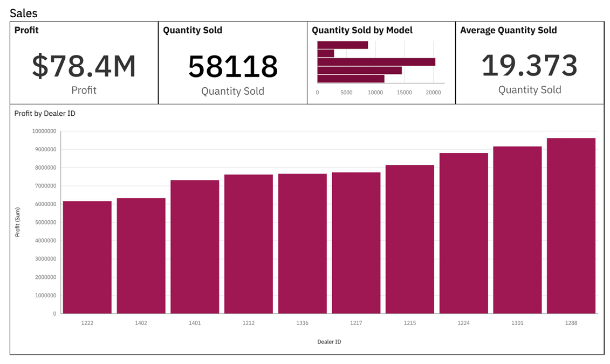
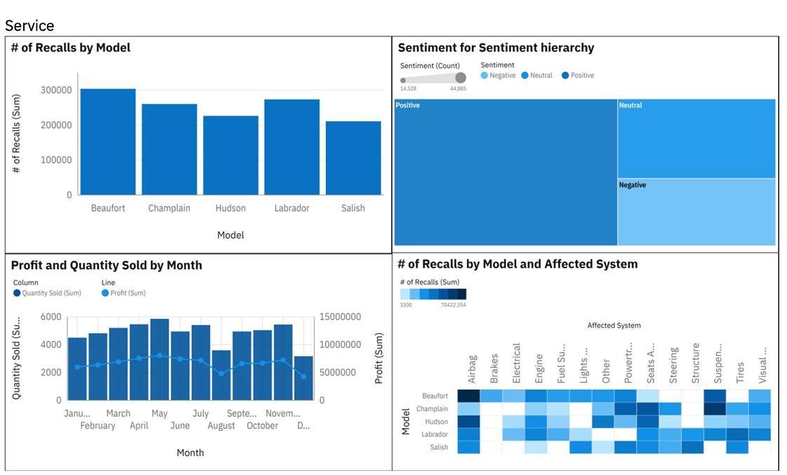

# Automative Quality Analysis Dashboard

## Business Objective
Analyze automotive sales, product performance, recalls, service quality, and customer sentiment to identify trends and support decision-making.

## Overview
This Power BI dashboard provides insights into quality performance, sales trends, product performance, and regional analysis.

## Tools Used
- Power BI
- Excel
- DAX

## Key Features
- KPI Monitoring
- Product Performance Analysis
- Regional Performance Analysis
- Trend Analysis
- Interactive Filters and Slicers

## Dashboard Preview

### Page 1

### Page 2

## Files
- Dashboard PDF Report
- Dashboard Screenshots
- Project Documentation

## Author
Sanjay P Raj
